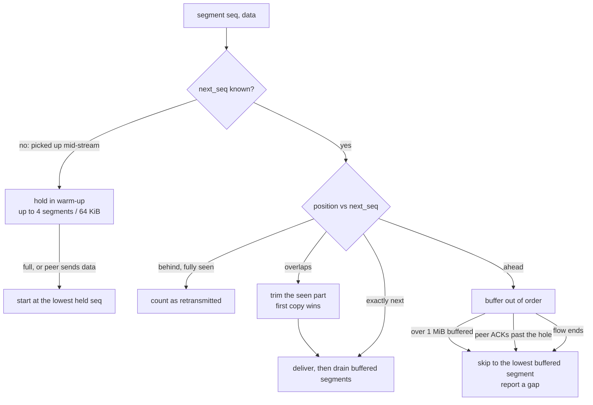

# Packet engine

The engine (`netcreds_ng.engine.engine.Engine`) turns frames into calls on protocol plugins. Its job is to give each plugin exactly the bytes each side of a connection sent, in order, once, with any missing bytes marked, whatever the capture looked like.

## Reading captures

`engine.pcapio.open_capture()` reads pcap and pcapng without third-party code:

- **pcap**: microsecond and nanosecond magic numbers, either byte order. FCS bits stored in the upper bits of the link-type field are masked off.
- **pcapng**: section headers in either byte order, several interfaces per file (each with its own link type and timestamp resolution, `if_tsresol`), Enhanced and Simple Packet Blocks.
- Every length field is bounds-checked (a single record is capped at 256 MiB). A truncated or corrupt file raises `CaptureFormatError` **after** every complete frame has been yielded, so the problem is reported without losing data.

Frame numbers start at 1 for each file, matching Wireshark.

The same module provides `PcapWriter` and `PcapngWriter`. The latter writes per-packet comments and is used by the evidence output and the test SDK.

## Decoding

`engine.decode` is a set of pure functions over `bytes`. Nothing in it raises on malformed input: anything that cannot be decoded returns `None`, and the engine counts it as *undecodable*.

1. `l3_offset(frame)` finds the IP header from the link type:

    | Link type | Handling |
    | --- | --- |
    | Ethernet (1) | 802.1Q, 802.1ad and QinQ VLAN tags are skipped; PPPoE session frames are unwrapped |
    | Raw IP (12, 14, 101, 228, 229) | IP version from the first nibble |
    | BSD null/loopback (0, 108) | address family in host or network byte order |
    | Linux cooked SLL (113), SLL2 (276) | protocol field |

2. `decode_ip()` decodes IPv4 (options, total length, fragment fields) or IPv6 (walking hop-by-hop, routing, destination-options and AH extension headers up to the Fragment header). It trims padding to the IP length field, handles IPv6 Jumbo Payloads, and accepts IPv6 packets with a zero payload length (from TSO/offload captures) by using the captured length.
3. `decode_l4()` decodes the TCP header (flags, sequence and ack numbers, data offset) or the UDP header, and returns a `Packet`.

## IP defragmentation

`engine.ipfrag.Defragmenter` reassembles IPv4 and IPv6 fragments keyed by (version, source, destination, protocol, identification).

- Coverage is a sorted list of disjoint byte intervals, so adding a fragment costs O(fragments), not O(bytes).
- On overlap, **the first fragment to arrive wins**, for every byte.
- At most 4,096 datagrams are pending, each buffering at most 4 × 64 KiB; incomplete datagrams expire after 60 seconds. Dropped datagrams are counted (`ip_fragments_expired`).
- Completed datagrams are remembered briefly by (offset, length, CRC-32) of their pieces. A late duplicate fragment is recognised and dropped (`ip_fragment_duplicates`) instead of opening a new datagram; a reused identification with new content starts a new one.
- For IPv6, extension headers that follow the Fragment header belong to the fragmentable part and are walked after reassembly.

The reassembled datagram continues as one packet. The frames that carried its fragments are remembered on the packet, so the evidence output can include all of them.

## Flows

Every TCP and UDP packet belongs to a flow, keyed by the protocol and the two endpoints in canonical order, so both directions share one entry.

### Client and server roles

When a flow is created, the engine decides which endpoint is the **client**:

1. A TCP SYN without ACK comes from the client; a SYN+ACK from the server. This is certain.
2. Otherwise, a port that is below 1024 or in some plugin's `default_ports` marks the server. If exactly one side has such a port, that is certain too.
3. Otherwise (both ports ephemeral, or both well-known) the roles are a guess: the side with the higher port is assumed to be the client.

In the third case the flow is **ambiguous** (`ambiguous_flows`). Every plugin then gets two contexts, one per orientation. The first context that emits a finding *wins*: its twin is detached, gets no further callbacks and no `on_close` (`orientation_resolved`). A plugin that raises an exception in a guessed orientation is detached quietly; the error is kept and reported only if the other orientation does not win either (`suppressed_orientation_errors`).

So a plugin never needs to handle "the wrong direction": in the wrong orientation it simply sees nothing it recognises.

### Plugin contexts

For each flow, the engine creates one `Context` per eligible plugin (by transport, and by port for `ports_only` plugins), and calls `plugin.new_state(flow)` to initialise `ctx.state`. Plugins run in `(priority, name)` order. A plugin that calls `ctx.detach()` gets no more callbacks for that flow; this is how plugins drop traffic that is not theirs, and it is what keeps the cost of offering every flow to every plugin low.

### Flow lifetime

A flow ends, and plugins get `on_close`, when:

- both sides sent FIN, or either sent RST;
- a new SYN arrives on the same four-tuple with a different initial sequence number, or after the old connection closed (port reuse);
- it has been idle for 10 minutes (TCP) or 2 minutes (UDP), checked every 2,048 frames read (decodable or not, so parallel workers sweep at the same frames);
- the table holds 100,000 flows and a new one arrives: the least recently active flow is closed (`evicted_flows`);
- the input ends (`Engine.finish()`).

## TCP reassembly

Each direction of a TCP flow is a `engine.tcp.TCPStream`. It turns segments into `Chunk`s: in-order bytes, with `gap_before` set when bytes are missing just before them, and the frame number and timestamp of the packet that carried them.



Details that matter:

- **Sequence arithmetic** is modulo 2³², so wraparound is handled.
- **Retransmissions and overlaps**: bytes already delivered are never delivered again; for overlapping segments the first copy wins. Duplicate bytes are counted (`tcp_retransmitted_bytes`).
- **Out of order**: segments ahead of the expected sequence number are buffered until the hole is filled.
- **Holes the capture lost**: if the *peer* acknowledges data beyond a hole, the receiver already has those bytes and no retransmission will appear in the capture. The stream skips the hole at once, reports the gap, and keeps request/response order.
- **Buffer limit**: more than 1 MiB buffered out of order in one direction forces a gap.
- **Streams without a SYN**: the first segments are held in a short *warm-up* (4 segments or 64 KiB), so a segment reordered ahead of the first captured one is not mistaken for a retransmission. Data from the other direction ends the warm-up early, so request/response order is kept.
- **Gaps** are counted (`tcp_gaps`, `tcp_gap_bytes`) and reported to plugins as `on_gap(size)` before the next `on_data`. The default `on_gap` detaches the plugin: joining bytes from both sides of a hole could produce a wrong credential reported as fact. Plugins that can resynchronise override it (see [the protocol reference](../reference/protocols.md#common-behaviour)).

Each chunk carries the frame number and timestamp of the packet that carried its bytes, not the packet that happened to release them. A finding therefore cites the frame where the credential actually is, even when it arrived out of order.

## TLS filtering

With a key log, every TCP chunk passes through a TLS filter before reaching plugins. The filter recognises a ClientHello (at the start of a connection or after STARTTLS), creates a TLS session, and replaces record bytes with decrypted application data, or with nothing when no keys are available. Up to 5 bytes that could be the start of a ClientHello are held until the decision can be made. See [TLS decryption internals](tls.md).

## UDP

UDP datagrams are delivered whole to `on_datagram` of every UDP plugin attached to the flow, with the direction resolved like TCP.

## Error isolation

Every plugin callback runs inside a `try`. An exception detaches that plugin from that flow only, increments `stats.plugin_errors[plugin]`, and records a message (the first 100 per run) such as:

```text
plugin ldap failed on flow 192.0.2.10:50000 -> 198.51.100.20:389: IndexError: index out of range
```

Other plugins on the same flow, and the same plugin on other flows, carry on. Messages appear under **Warnings** in the summary, and `--strict` turns them into exit code 3.

## Packet observers

`Engine.packet_observers` is a list of callables invoked with every decoded TCP/UDP `Packet` before plugins see it. Sinks that set `wants_packets = True` are registered here by the session; the evidence output uses it to keep a rolling buffer of frames per flow.

## Performance notes

- Plugins detach early from traffic that is not theirs, so most flows end up with only a few active contexts. Each flow keeps a list of its attached slots, pruned as plugins detach, so delivery skips detached plugins without looking at them.
- Hot paths have fast paths that give exactly the result of the full check (`tests/test_fast_paths.py`): Telnet option stripping copies runs of plain bytes in one step; the secrets scanner looks for cheap anchors before running full patterns; `keyvalue` runs its password regex only on lines containing `=` and a password field name; `telnet` searches for prompts only when the server output ends in `:`; the HTTP response parser searches only bytes it has not searched yet.
- A closed flow's objects are freed by reference counting at once: the engine breaks the slot ↔ emit-callback and twin-slot reference cycles in `_close`. While frames are processed, the young-generation garbage collection threshold is raised (`relaxed_gc`) and restored afterwards; the collector stays on.
- `-j N` divides the work by host pair across worker processes; see [parallel analysis](pipeline.md#parallel-analysis).
- `tools/bench.py --flows N` generates a capture and measures throughput, optionally under a profiler. See [Development](../development/index.md#benchmarks).
