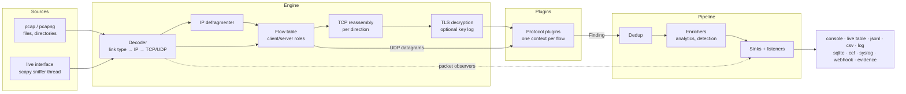

# Architecture

This section explains how netcreds-ng works inside: what happens to a frame between the capture file and the findings, and why each stage is built the way it is. Read it before writing a plugin that does anything unusual, or before changing the engine.

## The big picture

1. **Sources** produce `RawFrame` objects: frame number, timestamp, link type, bytes and wire length. Capture files are read by netcreds-ng's own pcap/pcapng reader; live capture uses scapy in a background thread.
2. The **decoder** finds the IP header for the frame's link type, decodes IPv4/IPv6 and the TCP or UDP header. Fragments go through the **defragmenter** first.
3. The **flow table** groups packets into connections, decides which side is the client, and creates one plugin *context* per (connection, plugin).
4. For TCP, each direction is a **TCPStream** that turns segments into in-order bytes with explicit gap markers. With a key log, a **TLS session** replaces record bytes with decrypted plaintext.
5. **Protocol plugins** receive stream bytes (`on_data`), gap notices (`on_gap`), UDP payloads (`on_datagram`) and the end of the connection (`on_close`). They emit **findings**.
6. The **pipeline** drops duplicates, runs enrichers (which may add findings, such as alerts), then hands each finding to every sink and listener.

The [`Session`](../api/session.md) class wires all of this together from a configuration; the CLI and the live table are thin layers over it.

## Module map

| Module | Responsibility |
| --- | --- |
| `netcreds_ng.cli` | argument parsing, configuration merging, mode selection |
| `netcreds_ng.config` | TOML configuration discovery and `--option` parsing |
| `netcreds_ng.session` | builds the engine, pipeline, plugins and sinks |
| `netcreds_ng.parallel` | `-j N`: frames split across worker processes by host pair, merged back into sequential order |
| `netcreds_ng.model` | `Finding`, `Endpoint`, `Kind`, `RunStats` |
| `netcreds_ng.engine.pcapio` | pcap/pcapng reader and writers |
| `netcreds_ng.engine.sources` | directory expansion, interface discovery, live capture |
| `netcreds_ng.engine.decode` | link-layer, IP and transport decoding |
| `netcreds_ng.engine.ipfrag` | IPv4/IPv6 fragment reassembly |
| `netcreds_ng.engine.tcp` | unidirectional TCP stream reassembly |
| `netcreds_ng.engine.tls` | TLS 1.2/1.3 record decryption from a key log |
| `netcreds_ng.engine.engine` | flow table, client/server roles, plugin dispatch, error isolation |
| `netcreds_ng.engine.pipeline` | dedup, enrichers, sinks |
| `netcreds_ng.plugins.api` | the public plugin API (version 1) |
| `netcreds_ng.plugins.registry` | plugin discovery, plugin sets and selection |
| `netcreds_ng.plugins.protocols.*` | the 23 protocol plugins and shared helpers (`_util`) |
| `netcreds_ng.plugins.enrichers.*` | `analytics`, `detection` |
| `netcreds_ng.plugins.sinks.*` | file, SQLite, webhook, SIEM and evidence outputs |
| `netcreds_ng.proto.*` | protocol parsers shared by plugins: DER/BER, HPACK, NTLMSSP |
| `netcreds_ng.output.*` | console rendering, run summary JSON, CEF/syslog/chat formats |
| `netcreds_ng.tui.*` | the live table (`--tui`) and the filter language |
| `netcreds_ng.legacy` | the faithful port of the original net-creds (`--legacy`) |
| `netcreds_ng.testing.*` | packet crafting, message builders, analysis harness, TLS lab |

## Pages in this section

- [Packet engine](engine.md): decoding, defragmentation, flows, TCP reassembly, plugin dispatch.
- [TLS decryption internals](tls.md): key log, key schedule, record processing.
- [Findings pipeline](pipeline.md): dedup, enrichers, sinks, parallel analysis.
- [Design principles](principles.md): the rules every part of the code follows.
