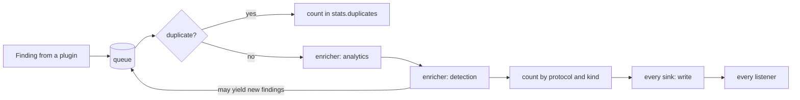
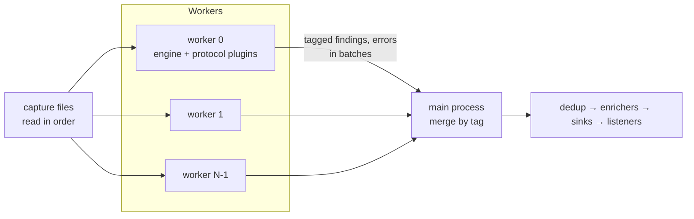

# Findings pipeline

Every finding a plugin emits goes through `netcreds_ng.engine.pipeline.Pipeline.publish()`:

1. **Dedup first**, so enrichers see each finding exactly once and their counters (weak passwords, host profiles, failure windows) are not inflated by repeats.
2. **Enrichers** run in `(priority, name)` order. Each may change the finding in place (tags, risk, `extra`) and may yield new findings, which go back on the queue and through dedup and every enricher. This is how the `detection` enricher's alerts reach the outputs.
3. **Sinks** receive the finding through `write()`.
4. **Listeners** are plain callables registered by the caller; the console renderer and the live table are listeners.

Each enricher and sink call is isolated: an exception is counted as `enricher:<name>` or `sink:<name>` in `stats.plugin_errors`, and processing continues.

## De-duplication

`Deduplicator` hashes `Finding.dedup_key()` with SHA-256:

- `off`: every finding is new;
- `run`: an in-memory set of hashes;
- `persistent`: the set plus a SQLite table `seen(key TEXT PRIMARY KEY)` in the `--dedup-db` file, so findings reported by earlier runs are suppressed. Only hashes are stored.

The key deliberately excludes the source port (so the same login over many connections is one finding) and includes the frame number for login results (so every attempt is kept). See [the de-duplication key](../reference/findings.md#de-duplication-key).

## Sinks

The pipeline calls `open(SinkContext)` on every sink before the first finding (also when there are no findings), `write(finding)` for each finding, and `close(stats)` once at the end. The session passes each sink:

- `target`: the PATH or URL part of the output option;
- `options`: the plugin options for that sink name, plus `summary` (a callable returning the analytics and detection summary) and `source_label` (the capture paths or interface).

Sinks with `wants_packets = True` are also registered as engine packet observers and receive `on_packet(pkt)` for every decoded packet.

## The session

`netcreds_ng.session.Session` assembles a run from a `SessionConfig`:

1. selects protocol plugins and enrichers from the registry (`enable`, `disable`, `plugin_options`);
2. instantiates the requested sinks;
3. builds the `Pipeline` (with the chosen dedup mode and the listeners) and the `Engine` (with excluded hosts and an optional TLS decryptor);
4. registers packet-observing sinks.

Then `open()`, `run_files(paths)` or `feed(frames)`, and `close()`, which flushes every flow (`Engine.finish()`) and closes the sinks. `summary()` merges the `analytics` and `detection` summaries, adding each host's score.

## Parallel analysis

With `jobs > 1`, `Session.run_files()` hands the files to `netcreds_ng.parallel.run_parallel()`, which splits one stream of frames (every file, in order) across worker processes:

- **Ownership.** Every worker reads every frame. `route()` assigns a frame to a worker by a hash of its unordered pair of IP addresses, so both directions of a connection, every connection between two hosts and every IP fragment of a datagram go to one worker. Frames without a readable IP header go to worker 0.
- **Same clock.** A worker analyses the frames it owns (`Engine.process_frame`) and only advances its clock for the others (`Engine.skip_frame`). The engine sweeps idle flows every `SWEEP_EVERY` frames *read*, so every worker sweeps at the same frames, with the same time, as a single engine would.
- **Tags.** Workers run the protocol plugins with dedup off (cross-plugin merging still follows the session's dedup mode). Each finding and plugin error is tagged with `Engine.emit_order`: the frame position, a phase (analysing the frame, the idle sweep after it, or the end of the run) and, while flows are closed, the position of the flow's last packet, which is the flow table's order. Worker 0 also tags the start of each file, for sinks with `on_source`.
- **Merge.** Workers send tagged events in batches with a watermark (every event up to that position has been sent). The main process publishes, in tag order, every event below the lowest watermark, so the findings reach dedup, enrichers and outputs in exactly the sequential order while the workers are still running. At the end it merges the engine counters (`RunStats.merge()`).
- **When.** `Session.parallel_workers()` decides: `jobs`, at most one per CPU, and sequential mode for inputs under `parallel.PARALLEL_MIN_BYTES` (16 MB), with a stop callback (the live table), or when a sink needs packets (`--evidence`).

Workers load the registry themselves (including `plugin_dirs`) and instantiate the parent's protocol plugins by name with the same options. The flow-table cap applies per worker.

## The console renderer

`netcreds_ng.output.console.ConsoleRenderer` is a listener that prints one line per finding and, at the end, the run summary tables from `RunStats` and `Session.summary()`. The CLI applies `--min-risk` before calling it; `--no-browsing`, `-v` and `-q` are renderer settings.
