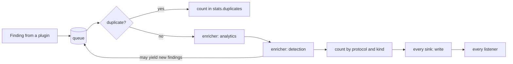
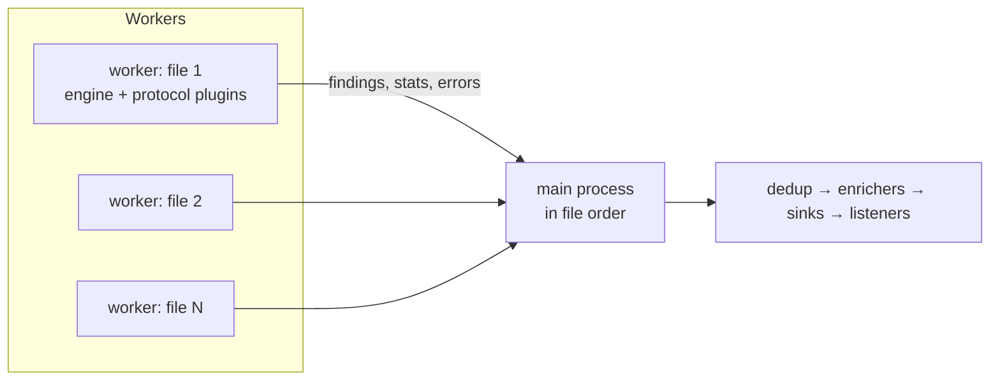

# Findings pipeline

Every finding a plugin emits goes through `netcreds_ng.engine.pipeline.Pipeline.publish()`:

1. **Dedup first**, so enrichers see each finding exactly once and their counters (weak passwords, host profiles, failure windows) are not inflated by repeats.
2. **Enrichers** run in `(priority, name)` order. Each may change the finding in place (tags, risk, `extra`) and may yield new findings, which go back on the queue and through dedup and every enricher. This is how the `detection` enricher's alerts reach the outputs.
3. **Sinks** receive the finding through `write()`.
4. **Listeners** are plain callables registered by the caller; the console renderer and the live table are listeners.

Each enricher and sink call is isolated: an exception is counted as `enricher:<name>` or `sink:<name>` in `stats.plugin_errors`, and processing continues.

## De-duplication

`Deduplicator` hashes `Finding.dedup_key()` with SHA-256:

- `off`: every finding is new;
- `run`: an in-memory set of hashes;
- `persistent`: the set plus a SQLite table `seen(key TEXT PRIMARY KEY)` in the `--dedup-db` file, so findings reported by earlier runs are suppressed. Only hashes are stored.

The key deliberately excludes the source port (so the same login over many connections is one finding) and includes the frame number for login results (so every attempt is kept). See [the de-duplication key](../reference/findings.md#de-duplication-key).

## Sinks

The pipeline calls `open(SinkContext)` on every sink before the first finding (also when there are no findings), `write(finding)` for each finding, and `close(stats)` once at the end. The session passes each sink:

- `target`: the PATH or URL part of the output option;
- `options`: the plugin options for that sink name, plus `summary` (a callable returning the analytics and detection summary) and `source_label` (the capture paths or interface).

Sinks with `wants_packets = True` are also registered as engine packet observers and receive `on_packet(pkt)` for every decoded packet.

## The session

`netcreds_ng.session.Session` assembles a run from a `SessionConfig`:

1. selects protocol plugins and enrichers from the registry (`enable`, `disable`, `plugin_options`);
2. instantiates the requested sinks;
3. builds the `Pipeline` (with the chosen dedup mode and the listeners) and the `Engine` (with excluded hosts and an optional TLS decryptor);
4. registers packet-observing sinks.

Then `open()`, `run_files(paths)` or `feed(frames)`, and `close()`, which flushes every flow (`Engine.finish()`) and closes the sinks. `summary()` merges the `analytics` and `detection` summaries, adding each host's score.

## Parallel analysis

With `jobs > 1` and several files, `Session.run_files()` uses a `ProcessPoolExecutor`:

- Each worker loads the registry itself (including `plugin_dirs`), runs the engine and protocol plugins on one file with dedup off, and returns its findings, `RunStats` and error messages.
- The main process merges the engine counters (`RunStats.merge()`) and publishes the findings **in file order** through its own pipeline, so dedup, analytics, alerts and outputs behave as in a sequential run.
- Sequential mode is used instead when there is only one file, when a stop callback is given (the live table), or when a sink needs packets (`--evidence`).

A connection split across two files is seen as two partial connections in parallel mode, while sequential mode carries flows across files.

## The console renderer

`netcreds_ng.output.console.ConsoleRenderer` is a listener that prints one line per finding and, at the end, the run summary tables from `RunStats` and `Session.summary()`. The CLI applies `--min-risk` before calling it; `--no-browsing`, `-v` and `-q` are renderer settings.
