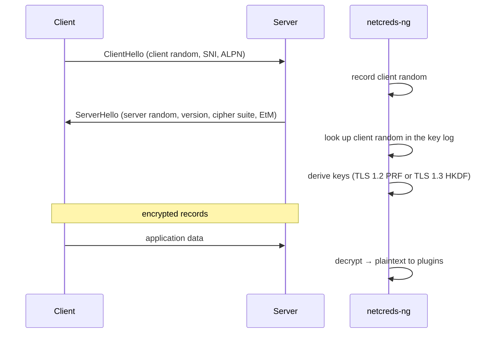

# TLS decryption internals

`netcreds_ng.engine.tls` decrypts TLS 1.2 and 1.3 with secrets from an NSS key-log file. It is a passive, receive-only implementation: it parses records and handshake messages that both peers already exchanged and derives the record keys from the logged secrets. The AEAD and block ciphers come from the `cryptography` package; everything else (record framing, PRF, HKDF labels, key schedule) is in the module. For how to use it, see [TLS decryption](../guide/tls-decryption.md).

## Components

| Class / function | Role |
| --- | --- |
| `KeyLog` | parses `CLIENT_RANDOM` (TLS 1.2) and the TLS 1.3 `CLIENT/SERVER_HANDSHAKE_TRAFFIC_SECRET` and `CLIENT/SERVER_TRAFFIC_SECRET_0` lines, indexed by client random; re-reads the file when a lookup misses and the file's size or modification time changed |
| `TLSDecryptor` | per-run factory holding the key log; refuses to start without `cryptography` |
| `TLSSession` | one TCP connection: record parsing, handshake tracking, key derivation, decryption |
| `prf12`, `hkdf_expand_label` | TLS 1.2 PRF (RFC 5246 §5) and TLS 1.3 HKDF-Expand-Label (RFC 8446 §7.1) |
| `keys12`, `keys13` | derive per-direction keys and IVs |
| `decrypt12`, `decrypt13` | record decryption, including TLS 1.2 CBC with HMAC and encrypt-then-MAC |
| `looks_like_client_hello`, `could_start_client_hello` | detection of the start of a TLS session in a byte stream |

## Session detection

The engine's TLS filter looks at each TCP direction's reassembled bytes. A session starts when the bytes look like a TLS handshake record carrying a ClientHello, either at the very start of a connection or later (STARTTLS, PostgreSQL SSLRequest, LDAP StartTLS...). When the client/server roles of a connection were only guessed, either side may send the ClientHello; the TLS session's "client" is whoever sent it.

A ClientHello's first 6 bytes may be split across segments. Up to 5 bytes that could still start one are held back until the decision is possible; if they turn out not to be TLS, they are released to the plugins unchanged (also at the end of the connection).

## Handshake and keys

- From the ClientHello: the client random, and the SNI and ALPN extensions.
- From the ServerHello: the server random, the selected cipher suite, the negotiated version (from `supported_versions` for TLS 1.3) and the encrypt-then-MAC extension. A HelloRetryRequest is recognised by its fixed random and skipped.
- **TLS 1.2**: the master secret from `CLIENT_RANDOM` is expanded with the PRF into client and server write keys, MAC keys and IVs.
- **TLS 1.3**: the handshake and application traffic secrets are expanded with HKDF-Expand-Label into keys and IVs. Each direction holds a list of candidate keys (handshake, then application); a record is tried with the current key, then the next, and the list advances on success. Post-handshake messages are reassembled across records, and a KeyUpdate derives the next application secret (`traffic upd`).

Status values: `handshake` → `decrypting`, or `no-key` (client random or secret missing), `unsupported` (version or cipher suite; the reason is reported as a warning), `failed` (an authentication failure or malformed record).

## Records

- Records are parsed from the reassembled stream; a header that is not a TLS record type, not version 3.x, or longer than 2¹⁴ + 2048 bytes marks the stream as not TLS.
- In TLS 1.2 everything after ChangeCipherSpec is protected; without keys it is skipped rather than misread as plaintext.
- In TLS 1.3 every record after the ServerHello is protected, except ChangeCipherSpec compatibility records.
- Sequence numbers are tracked per direction for the AEAD nonce and the CBC MAC. A **capture gap** makes the sequence number unknown, so that direction stops decrypting.
- A record that fails authentication is never passed on. In TLS 1.3, records that no key opens before the first success are handshake records whose secrets are not in the key log, and are skipped.

## Ciphers

| Version | Suites |
| --- | --- |
| TLS 1.3 | `TLS_AES_128_GCM_SHA256`, `TLS_AES_256_GCM_SHA384`, `TLS_CHACHA20_POLY1305_SHA256` |
| TLS 1.2 | ECDHE/DHE/RSA suites with AES-GCM, ChaCha20-Poly1305, and AES-CBC with HMAC-SHA1/SHA256/SHA384 (MAC-then-encrypt or encrypt-then-MAC) |

The exact list is the `SUITES12` / `SUITES13` tables in the module. Not supported: TLS 1.0/1.1, SSL, 0-RTT early data, compression, RSA private-key decryption.

## Plaintext delivery and tagging

Decrypted chunks are marked `decrypted`. While a plugin handles such a chunk, the engine tags every finding it emits `tls-decrypted`; at `on_close`, findings are tagged only if that plugin's last data was decrypted. Plugins can check `ctx.tls_decryption` to know a key log is loaded, and keep parsing after STARTTLS instead of detaching, because they will receive plaintext or nothing, never ciphertext.

## Testing

`netcreds_ng.testing.tls_lab.tls_conversation()` runs a real TLS 1.2 or 1.3 session through OpenSSL (Python's `ssl` module with memory BIOs; no sockets), records every byte into a `TCPConversation`, and returns the key log OpenSSL wrote. Decryption is therefore tested against an independent TLS implementation. See [Testing plugins](../plugins/testing.md#testing-behind-tls).
