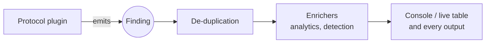

# Core concepts

## Findings

Everything netcreds-ng reports is a **finding**: one structured record with a protocol, a kind, a risk, the two endpoints, the capture time and frame number, and kind-specific fields (username, secret, domain, value, tags, extra details).

The same record goes to the console and every output. A JSON Lines file and the SQLite database hold the same findings. The full field list is in the [findings reference](../reference/findings.md).



## Kinds

The `kind` says what a finding represents.

| Kind | Shown as | Meaning | Secret? |
| --- | --- | --- | --- |
| `credential` | credential | a username and a secret together (`user:password`) | yes |
| `username` | username | a username seen without its secret | no |
| `password` | password | a secret seen without a username | yes |
| `token` | token | a bearer token, JWT, OAuth token | yes |
| `api_key` | api key | an API key or cloud access key | yes |
| `cookie` | cookie | a session cookie | yes |
| `community` | community | an SNMP community string | yes |
| `auth_event` | auth | an authentication that happened, described by metadata only | no |
| `auth_result` | result | a login outcome: succeeded or failed | no |
| `url` | url | an HTTP request URL | no |
| `post` | post | an HTTP POST body (printable bodies only) | no |
| `search` | search | a search query found in a URL or form | no |
| `info` | info | other context, such as an Oracle connect descriptor or a TACACS+ command | no |
| `alert` | ALERT | a behavioural detection such as brute force, raised by an enricher | no |

The kinds marked *secret* are the ones that count as cleartext exposure.

`url`, `post` and `search` are **browsing** findings. They show what users did rather than how they authenticated. Hide them with `--no-browsing` on screen, `-kind:url` in the live table's filter, or `--option http.urls=false` to stop collecting URLs.

## Credentials versus authentication events

This distinction runs through the whole tool.

**Cleartext credentials are reported in full.** An FTP password, an HTTP Basic header, an LDAP simple bind or a MySQL `mysql_clear_password` login put the secret on the wire as is. Anyone who can see the traffic has it. The secret is the exposure, so the finding contains it.

**Challenge/response logins are reported as events.** NTLM, Kerberos, HTTP Digest, CRAM-MD5, PostgreSQL MD5/SCRAM, MySQL native, Oracle O5LOGON, VNC authentication and RADIUS CHAP never send the password itself. netcreds-ng reports *that* the login happened, who it was for, and how strong the scheme is, as an `auth_event`:

```text
16:13:20 HIGH   NTLM      auth       192.0.2.10:50012 > 198.51.100.20:445 NTLMv1 authentication  #ntlmv1
16:13:20 MEDIUM Kerberos  auth       192.0.2.10:51001 > 198.51.100.20:88 Kerberos pre-authentication (rc4-hmac)  #weak-etype-offered #weak-preauth-rc4-hmac
```

The challenge, the response, the hash and the ticket are never extracted, stored or hashed. That material is useful only for offline cracking, which is out of scope. What a defender needs to know is that NTLMv1 or RC4 is still in use, and on which hosts.

## Risk

Every finding has a risk level. Plugins set it, and enrichers can raise it.

| Risk | Typical findings |
| --- | --- |
| **high** | cleartext passwords, tokens and API keys; NTLMv1; DES Kerberos; accounts without Kerberos pre-authentication; SNMPv3 noAuthNoPriv; VNC without authentication; RDP standard security; every alert; any weak password |
| **medium** | session cookies; NTLMv2; RC4 Kerberos; HTTP Digest; challenge/response database logins; SNMPv3 authNoPriv; RDP over TLS without NLA |
| **low** | strong authentication observed (Kerberos AES, RDP with NLA), RDP cookie usernames, connection metadata |
| **info** | login results, most usernames seen alone, URLs, searches, POST bodies, other context |

Filter by risk with `--min-risk` on the console, `risk:medium+` in the live table, or `min_risk` on network outputs.

## Tags

Tags are short facts attached to a finding. Plugins add protocol facts (`nonstandard-port`, `ntlmv1`, `no-preauth`, `write-access`). Enrichers add assessments (`cleartext`, `weak-password`, `password-reuse`, `brute-force`). The engine adds `tls-decrypted` to findings that were only visible because a key log was supplied.

The [tag glossary](../reference/findings.md#tags) lists them all.

## Confidence

Most findings have confidence 1.0: the protocol was parsed properly. Two heuristics report lower confidence:

- `telnet` at 0.6 (tagged `heuristic`) when it sees a login prompt on a non-Telnet port with no Telnet option negotiation;
- `keyvalue` at 0.5 for `user=... pass=...` patterns in non-HTTP streams.

[`--strict-heuristics`](../reference/cli.md#-strict-heuristics) ignores the first and disables the second.

## Login results and outcomes

Where a protocol reports whether a login worked, the plugin emits an `auth_result` finding right after the credential or event. The `value` reads like `login failed` or `Basic login succeeded (HTTP 200)`, and `Finding.outcome` turns it into `success`, `failure` or unknown. The behavioural detections depend on these results. See [alerts and analytics](../guide/detections.md).

## Connections, client and server

netcreds-ng follows connections, not packets. For each TCP or UDP conversation it decides which side is the **client** (the side that sent the SYN, or, without a handshake, the side using the ephemeral port) and which is the **server**. `src` and `dst` on a finding always read client → server, even for a result that the server sent.

When the capture starts mid-connection and the ports cannot decide (both ephemeral, or both well-known), every plugin is offered both orientations and the first one that produces a finding wins. The run summary counts these flows as *ambiguous direction*. See [the packet engine](../architecture/engine.md#client-and-server-roles).

## De-duplication

A credential sent ten times on one connection, or on ten connections to the same server, is reported once per run by default. Each login *result* is kept, because repeated failures are exactly what brute-force detection needs. Choose the mode with `--dedup`:

| Mode | Behaviour |
| --- | --- |
| `run` (default) | suppress repeats within this run |
| `off` | report everything |
| `persistent` | also suppress findings seen in earlier runs, using a SQLite state file (`--dedup-db`, default `netcreds-ng-state.sqlite3`) |

Suppressed duplicates are counted in the run summary.

## Nothing dropped silently

Problems never disappear:

- a plugin that raises an exception is detached from that connection, and the error is counted per plugin and shown under **Warnings**;
- unreadable or truncated capture files are reported after every readable frame has been processed;
- capture gaps, retransmissions, IP fragments, truncated frames, non-IP frames, evicted connections and TLS sessions without keys are all counted in the summary.

`--strict` makes netcreds-ng exit with code 3 when any plugin or source warning occurred, which is useful in automation.
