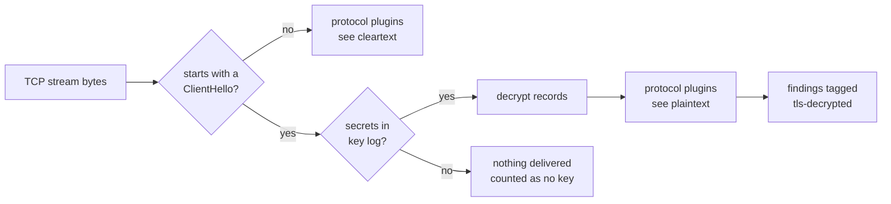

# TLS decryption

Most credentials today travel inside TLS. If you control the clients, you can give netcreds-ng the TLS session secrets so it can audit what is inside: which accounts log in, with which mechanisms, and which tokens and API keys are sent.

!!! warning "Authorisation"

    Decrypt only traffic you are authorised to inspect. A key log lets anyone holding the capture read every session it covers. Protect the key-log file like the credentials themselves.

## Requirements

Install the `tls` extra, which adds the `cryptography` package:

```bash
pip install ".[tls]"
```

Without it, `--tls-keylog` stops with an error explaining what is missing.

## Producing a key log

Many TLS clients write session secrets to the file named in the `SSLKEYLOGFILE` environment variable, in the [NSS key-log format](https://firefox-source-docs.mozilla.org/security/nss/legacy/key_log_format/index.html):

=== "Linux/macOS"

    ```bash
    export SSLKEYLOGFILE="$HOME/tls-keys.log"
    firefox &                         # Firefox, Chrome and Chromium honour it
    curl https://intranet.example/    # curl built with OpenSSL, GnuTLS, NSS...
    ```

=== "Windows"

    ```powershell
    $env:SSLKEYLOGFILE = "$env:USERPROFILE\tls-keys.log"
    & "C:\Program Files\Mozilla Firefox\firefox.exe"
    ```

=== "Python"

    ```python
    import ssl
    ctx = ssl.create_default_context()
    ctx.keylog_filename = "tls-keys.log"
    ```

Then capture the traffic as usual and analyse it with the key log:

```bash
netcreds-ng -p https-session.pcapng --tls-keylog tls-keys.log
```

The key log can also be set in the configuration file (`[output] tls_keylog = "keys.log"`).

## What happens



- A TLS session is recognised by its ClientHello, at the start of a connection or after a STARTTLS upgrade (SMTP, IMAP, POP3, LDAP StartTLS, PostgreSQL SSLRequest, ...). Detection is by content, so port 443 is not required.
- The handshake is parsed for the client and server randoms, version, cipher suite, SNI, ALPN and encrypt-then-MAC. The secrets are looked up in the key log by client random.
- Decrypted application data is passed to the protocol plugins exactly like a cleartext stream. HTTPS reaches `http` or `http2`, SMTPS reaches `mail`, and so on.
- Plugins **never receive ciphertext**: a session without keys delivers nothing, so plugins that understand STARTTLS keep parsing instead of giving up.

## Supported versions and ciphers

| Version | Cipher suites |
| --- | --- |
| TLS 1.3 | AES-128-GCM, AES-256-GCM, ChaCha20-Poly1305; KeyUpdate is followed |
| TLS 1.2 | AES-GCM, ChaCha20-Poly1305, AES-CBC with HMAC-SHA1/SHA256/SHA384, with or without encrypt-then-MAC |

Not supported: TLS 1.0/1.1, SSL 3, 0-RTT early data, compression, QUIC/HTTP/3, and decryption with a server RSA private key (only key logs are used). Records that fail authentication are discarded, never passed on.

## Reading the results

Findings from decrypted traffic carry the `tls-decrypted` tag. Here, an HTTPS request with Basic authentication over TLS 1.3, recorded with the [TLS lab](../plugins/testing.md#testing-behind-tls):

```console
$ netcreds-ng -p https.pcap --tls-keylog keys.log
16:13:20 INFO   HTTP      url        192.0.2.10 GET intranet.example/admin  #tls-decrypted
16:13:20 HIGH   HTTP      credential 192.0.2.10:50443 > 198.51.100.20:443 alice:Fake-Pass-1  #tls-decrypted
16:13:20 INFO   HTTP      result     192.0.2.10:50443 > 198.51.100.20:443 Basic login succeeded (HTTP 200)  #tls-decrypted
```

Without `--tls-keylog`, the same capture produces no findings.

They are **not** counted as cleartext exposure. They do not get the `cleartext` tag, and they do not mark the service as exposing cleartext secrets in the inventory, because the credential was encrypted on the wire. They still count towards alerts, password reuse and weak-password analysis, which is often the point: a weak password used over HTTPS is still a weak password.

The run summary reports what happened to every TLS session:

```text
  TLS sessions    1          Decrypted / no key       1 / 0
```

When some sessions are neither decrypted nor missing keys, the count is added in brackets, for example `9 / 2 (1 other)`. These counters appear only when a key log is loaded.

| Counter | Meaning |
| --- | --- |
| Decrypted | the session's records were decrypted |
| No key | the key log has no secrets for this session |
| Other | unsupported version or cipher, or a failure such as a capture gap; the reason is listed under Warnings for unsupported sessions |

A capture gap inside a TLS session stops decryption for that direction, because the record sequence number is no longer known. A gap in the unencrypted handshake is different: once the ClientHello's random (client side) or the ServerHello (server side) has been seen, decryption resumes at the next record, because no protected record was lost. If the gap swallowed the ChangeCipherSpec itself, that direction stops. A session decrypted in one direction only is listed under Warnings ("TLS decrypted in one direction only: *reason*").

TLS 1.2 renegotiation is followed: the new handshake's keys are looked up in the key log, and each direction switches to them at its next ChangeCipherSpec. If the key log has no entry for the new handshake, that direction stops decrypting.

## Live capture

During live capture the key log is re-read whenever a lookup fails and the file has changed since it was last read, so a browser can keep appending secrets while netcreds-ng runs.
